# [rishabh.bio](https://rishabh.bio/) - v2.5

This is the source code for my personal website - a developer and photographer portfolio.

    
    
    
    

  

## Table of Contents

- [Design](#design)
  - [Fonts](#fonts)
  - [Color Scheme](#color-scheme)
  - [Icon](#icon)
- [Wireframes](#wireframes)
- [Built With](#built-with)
- [Creator / Maintainer](#creator--maintainer)

---

## Design

### Fonts

[Fire Code](https://fonts.google.com/specimen/Fira+Code) - headings and code text

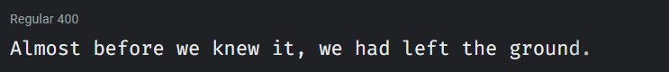

[Nunito](https://fonts.google.com/specimen/Nunito) - normal text

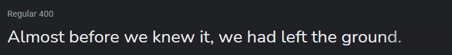

### Color Scheme

- White - all normal text color
- Oxford Blue - page background color, text color on white background
- Charm Pink - links, nav bar item hover, icon hover color
- Shamrock Green - Charm Pink links hover color
- Viridian Green - project skill text color
- Slate Gray - mobile navbar background color

<a href="https://coolors.co/ffffff-1d263b-f08cae-399e5a-0fa3b1-6b818c">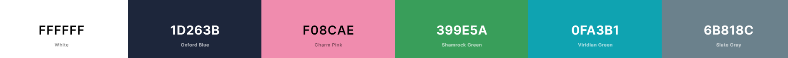</a>

### Icon

This is the icon of me on the Home and About pages.

_Art credits to my friend [wynn.draws](https://www.instagram.com/wynn.draws/)._

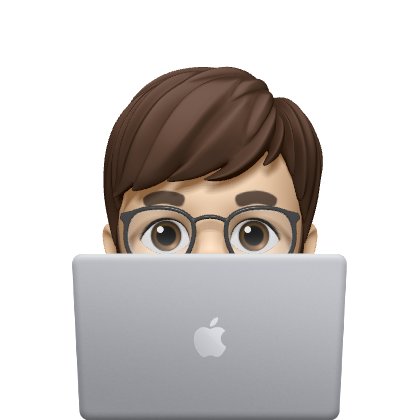
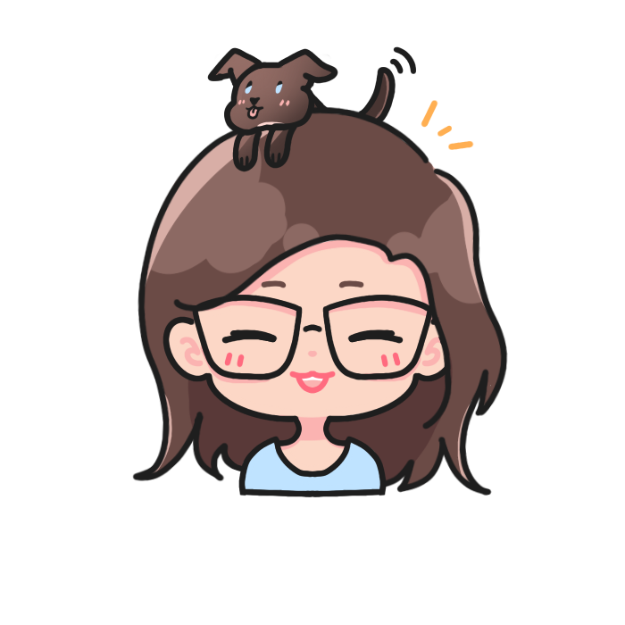
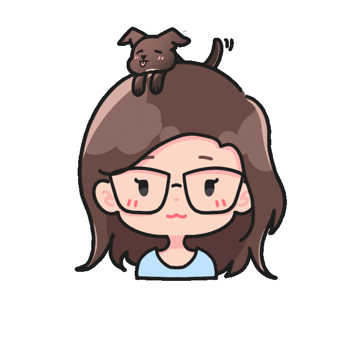

---

## Wireframes

I made a mix of low and high fidelity wireframes for the pages of my website. The final product looks mostly like this, but small changes are made along the way.

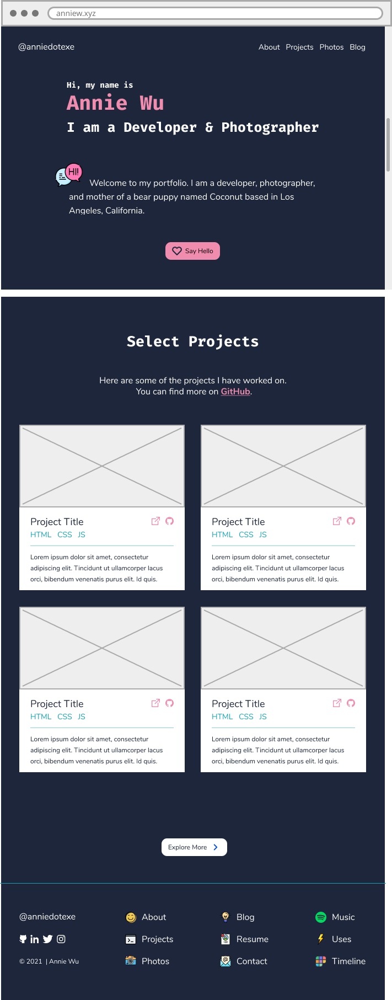
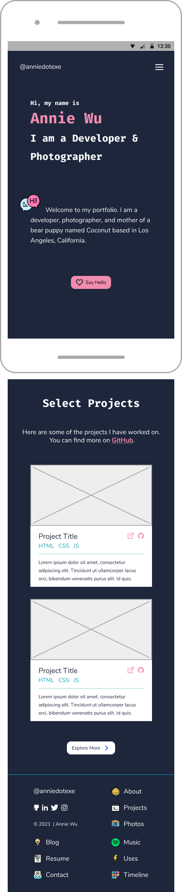
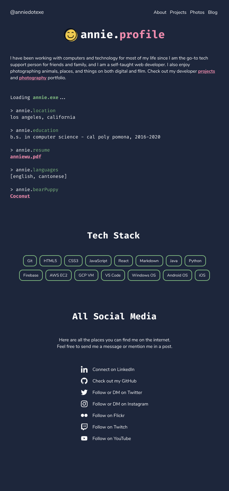
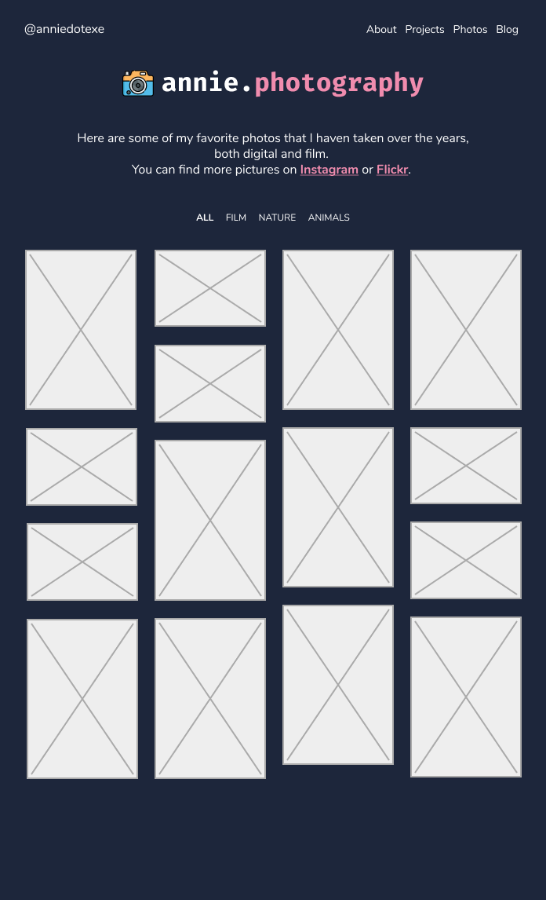
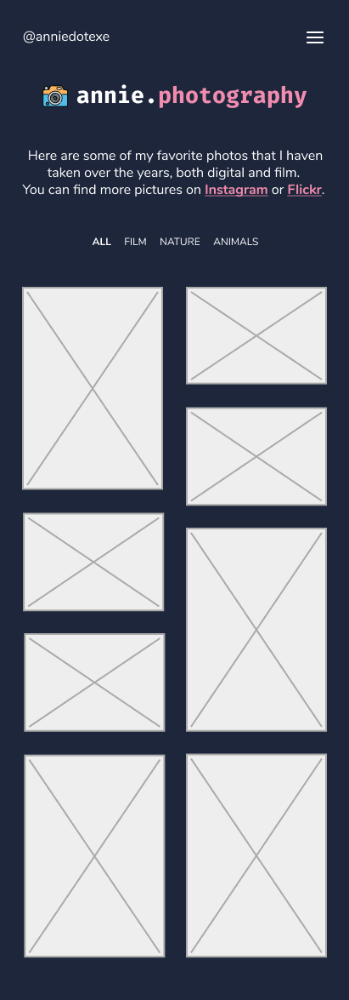

---

## Built With

- 💙 [HTML5](https://www.w3schools.com/html/)
- 💜 [CSS3](https://www.w3schools.com/css/)
- 💙 [JavaScript](https://www.w3schools.com/js/DEFAULT.asp)
- 💜 [Flaticon](https://www.flaticon.com/) and [FontAwesome](https://fontawesome.com/v5.15/icons?d=gallery&p=1) for the icons
- 💙 [Google Domains](https://domains.google/) for the cool domain
- 💜 [Netlify](https://www.netlify.com/) for hosting
- 💙 [Figma](https://www.figma.com/) for design and prototyping tools

---

## Creator / Maintainer

Rishabh Raj ([rishabh053](https://github.com/rishabh053))

If you have any questions, comments, or concerns, feel free to contact me below.

  

This project was created for educational purposes and for personal use. Feel free to take inspiration.
- If you are interested in forking this to use as a template for your own portfolio website, please give credit (i.e., in the readme) and ensure to update all information and content to be yours before deploying, so you are not displaying my content and information as your own. Thanks. :D

If you like my content or find this code useful, give it a ⭐ or support me by buying me a coffee ☕💙

---

### License

Copyright &copy; 2021-2023 Rishabh Raj. All rights reserved.
